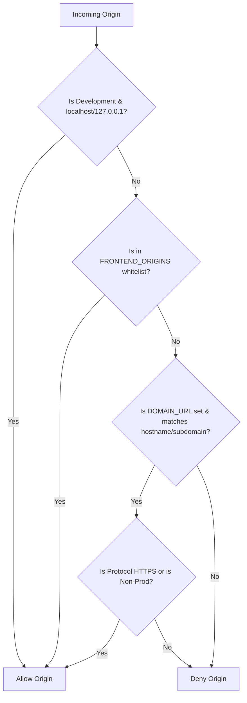

# Design Decision: Unified Origin Validator

**Date:** 2026-07-24  
**Status:** Approved & Implemented  
**Context:** Resolves [SEC-H1](../audit/2026-07-20/security-audit.md#L243) (loose CORS origin substring matching) and unifies checking logic.

---

## 1. Context & Problem Statement

AuthKit validates incoming request origins across three security checkpoints:

1.  **CORS (Cross-Origin Resource Sharing)**: Authorizing cross-origin browser API calls (e.g. `fetch` or `Axios`).
2.  **CSRF (Cross-Site Request Forgery) Middleware**: Blocking unauthorized domains from invoking state-changing API endpoints.
3.  **Redirect Validation**: Ensuring OIDC and Magic Link login redirect flows only target trusted callback URLs.

Previously, CORS allowed cross-origin access to any domain containing `DOMAIN_URL` as a substring. Since credentials are permitted (`credentials: true`), this allowed an attacker (e.g. `https://localhost.attacker.com`) to read sensitive user tokens and authenticate under cross-origin contexts.

Furthermore, these security checks were handled using separate, inconsistent, and ad-hoc string operations across different middleware files.

---

## 2. Key Architectural Decisions

### Decision 2.1: Why do we need CORS allowed origins if `FRONTEND_ORIGINS` is for OIDC/Auth redirection?

Redirections (HTTP 302/303) and CORS serve separate mechanisms:

- **Redirection**: Browser-level navigation (changing the address bar). The browser does not apply CORS rules to HTTP redirects.
- **CORS**: Asynchronous API requests made in the background by frontend JS code (e.g. `GET /user/me`). If AuthKit does not explicitly return CORS response headers corresponding to the initiating frontend's origin, the browser blocks the response.
- **Consolidated Policy**: Both flows require validation of the same set of trusted origins.

### Decision 2.2: If we have `DOMAIN_URL`, why do we need `FRONTEND_ORIGINS`?

`FRONTEND_ORIGINS` acts as the primary whitelist, complementing `DOMAIN_URL` by handling:

- **Redirection Fallback**: Providing a default target URL (typically `FRONTEND_ORIGINS[0]`) to land users when no client redirect parameters are provided.
- **Local Development**: Allowing local dev environments to run on different ports (e.g., frontend on `http://localhost:3000` vs. backend on `http://localhost:8000`), which are distinct origins.
- **Cross-Domain Clients**: Authorizing external trusted applications hosted outside the primary company root domain (e.g., `https://partner-app.com`).

### Decision 2.3: Future-Proofing for Reverse Proxies (Nginx) & Multi-Tenancy

To support dynamic subdomains (e.g., `https://*.yourdomain.com` for multi-tenant SaaS clients) in production while preserving simple local testing and Nginx compatibility:

1.  **Transparent Origin Delegation**: Browsers automatically attach the `Origin` header. Nginx forwards the `Origin` header unchanged, meaning the application logic handles CORS validation transparently.
2.  **Proxy Trust**: For Express to correctly understand client IPs and protocol routing (TLS termination by Nginx), the server configures:
    ```ts
    app.set('trust proxy', 1);
    ```
    Nginx is configured to forward standard proxy headers:
    ```nginx
    proxy_set_header Host $host;
    proxy_set_header X-Real-IP $remote_addr;
    proxy_set_header X-Forwarded-For $proxy_add_x_forwarded_for;
    proxy_set_header X-Forwarded-Proto $scheme;
    ```

---

## 3. The Solution: Unified Origin Validator

We introduced a single helper function, `isAllowedOrigin(origin?: string): boolean`, implemented in [url.util.ts](../../src/core/common/utils/url.util.ts), and integrated it across CORS, CSRF, and Redirect validators.

### Origin Check Logic



### Implementation Details

#### 1. Core Checker Utility

Located in [url.util.ts](../../src/core/common/utils/url.util.ts):

```ts
export const isAllowedOrigin = (origin?: string): boolean => {
  if (!origin) return false;

  const normalized = origin.toLowerCase().trim();

  // 1. Development: Allow any localhost/127.0.0.1 origin on any port
  if (
    config.NODE_ENV !== 'production' &&
    (normalized.startsWith('http://localhost:') ||
      normalized.startsWith('http://127.0.0.1:') ||
      normalized === 'http://localhost' ||
      normalized === 'http://127.0.0.1')
  ) {
    return true;
  }

  // 2. Static Whitelist: Allow exact matches in FRONTEND_ORIGINS config
  if (config.FRONTEND_ORIGINS.some(o => o.trim().toLowerCase() === normalized)) {
    return true;
  }

  // 3. Multi-Tenant Subdomain Matching: Allow https://*.yourdomain.com
  if (config.DOMAIN_URL) {
    try {
      const url = new URL(normalized);

      // Strict Protocol: Only allow HTTPS in production for wildcard subdomains
      const isAllowedProtocol =
        config.NODE_ENV === 'production'
          ? url.protocol === 'https:'
          : url.protocol === 'http:' || url.protocol === 'https:';

      if (isAllowedProtocol) {
        const targetDomain = config.DOMAIN_URL.toLowerCase().trim();
        const suffix = `.${targetDomain}`;

        // Matches exact root domain (yourdomain.com) or any subdomain (*.yourdomain.com)
        if (url.hostname === targetDomain || url.hostname.endsWith(suffix)) {
          return true;
        }
      }
    } catch {
      return false;
    }
  }

  return false;
};
```

#### 2. CORS Integration

Located in [index.ts](../../src/api/index.ts):

```ts
app.use(
  cors({
    origin: (origin, callback) => {
      if (!origin) return callback(null, true);

      if (isAllowedOrigin(origin)) {
        return callback(null, true);
      }

      return callback(new Error('Not allowed by CORS'));
    },
    credentials: true,
    // ...
  })
);
```

#### 3. CSRF Middleware Integration

Located in [csrf.middleware.ts](../../src/api/v1/middlewares/csrf.middleware.ts):

```ts
if (config.NODE_ENV === 'production' && (!origin || !isAllowedOrigin(origin))) {
  return next(new UnauthorizedException('Invalid Origin for auth action'));
}
```

#### 4. Redirect Validation Integration

Located in [url.util.ts](../../src/core/common/utils/url.util.ts):

```ts
export const getValidRedirectUrl = (requestedUrl?: string): string => {
  const defaultOrigin = config.FRONTEND_ORIGINS[0];

  if (!requestedUrl) {
    return defaultOrigin;
  }

  try {
    const url = new URL(requestedUrl);

    if (isAllowedOrigin(url.origin)) {
      return requestedUrl;
    }

    logger.warn(`Rejected redirect URL: ${requestedUrl}. Origin ${url.origin} is not allowed.`);
    return defaultOrigin;
  } catch {
    return defaultOrigin;
  }
};
```

---

## 4. Consequences & Benefits

- **Consistent Security**: One change to domain/subdomain matching rules applies everywhere instantly.
- **Production Safety**: Subdomain checking ensures that attacker suffixes (e.g. `https://yourdomain.com.attacker.com` or `https://attacker-yourdomain.com`) are rejected. HTTPS is strictly enforced in production.
- **Developer Experience**: Allows arbitrary localhost configurations and dev client setups without requiring tedious changes to configuration files during testing.
